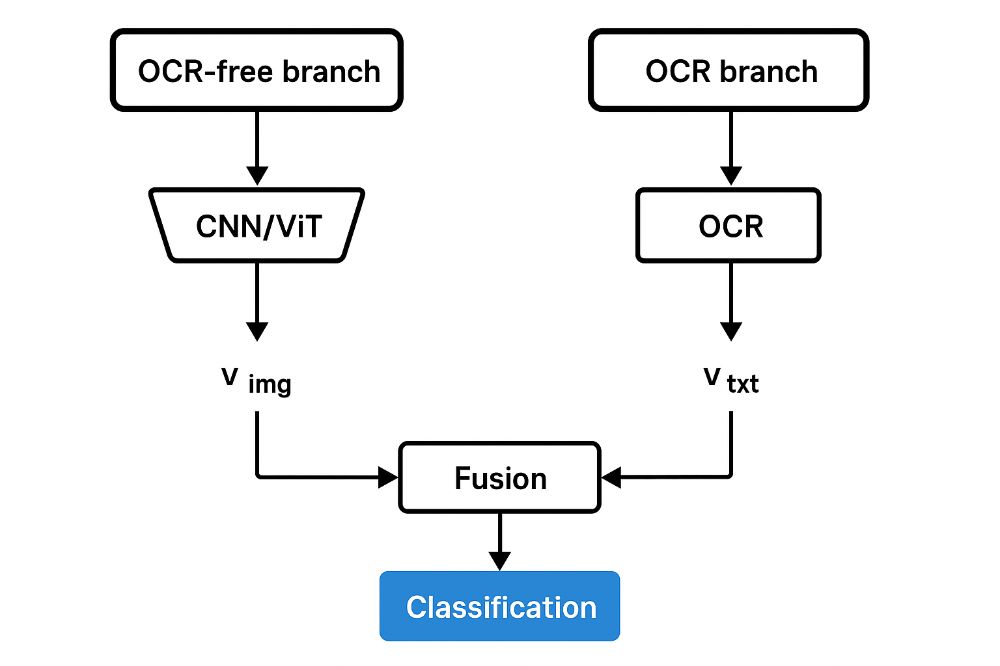

# COUNTRYDET
Use CLIP as a feature extractor so that the final answer is based not only on the OCR model but also on other image features


# Installation
### Install requirements
```
pip install -r requirements.txt
```
or in Google colab:
```
!pip install open_clip_torch easyocr rapidfuzz
```

### Use Dicker
`build.sh` build docker image

`start.sh` start docker container

`into.sh` go into docker container

```
chmod +x build.sh start.sh into.sh
./build.sh 
./start.sh 
./into.sh 
```

# Prepare data
dataset_orig -> split in dataset folder
TRAIN_VAL_COUNT = 90 - samples count in train+val
TEST_COUNT = 10 - samples count in test
```
python countrydet/dataset/split_imgs.py
```

# Train
### Local
```
python -m countrydet.main train --root dataset/train_val --epochs 10 --batch_size 2 --image_size 224 --lr 1e-4
```

### Google colab
```
!cd country_recognition; python -m countrydet.main train --root dataset/train_val --epochs 10 --batch_size 32 --image_size 224 --lr 1e-3
```

# Inference
### Local
```
python -m countrydet.main predict --image src/UZB_12.jpg --image_size 224 --weights "none" > logs/untrained_metrics.json
```

python -m countrydet.main eval --root dataset/test --image_size 224 --weights "none" > logs/untrained_metrics.json

### Google colab
```
!cd country_recognition; python -m countrydet.main predict --image src/UZB_12.jpg --image_size 224 --weights "best.pt"
```

# Results
[See more](docs/EXPERIMENTS.md)

# Contact Me

@BigBadData
